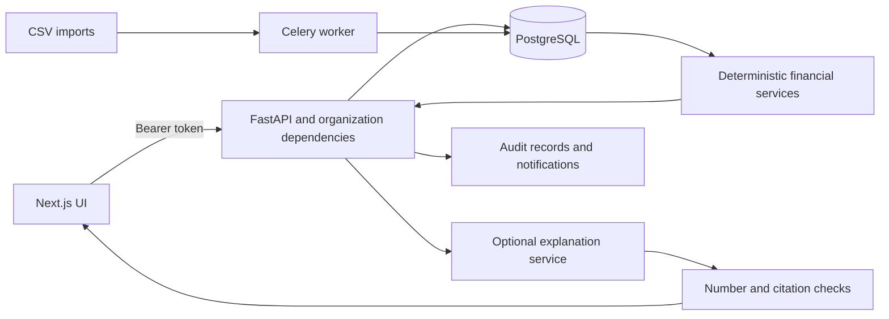

# FoundersHQ

FoundersHQ is a financial-planning prototype for early-stage startups. It imports
transactions and invoices, turns them into spending and collection views, projects
cash under explicit assumptions and keeps a record of changes. A FastAPI backend
owns the calculations and authorization; a Next.js frontend provides the dashboard,
invoice workflow and planning screens.

Its strongest technical idea is to keep **financial calculations separate from
language-model explanations**. Cash projections are reproducible from stored inputs.
Explanations are checked against a supplied facts payload and allowed record IDs.
The distinction matters because a persuasive explanation is not evidence that a
number is correct.

## What to inspect

| Area | Implementation | What it demonstrates |
| --- | --- | --- |
| Cash planning | [Forecast route](backend/app/api/routers/runway.py), [history baseline](backend/app/services/runway/history.py), [cash simulation](backend/app/services/runway/forecast.py) | Decimal arithmetic, explicit assumptions, evidence retention and missing-data handling |
| Organization access | [Dependencies](backend/app/deps.py), [member administration](backend/app/api/routers/org.py) | Tenant scoping, role gates, owner controls and authorization tests |
| Invoice operations | [Invoice routes](backend/app/api/routers/invoices.py), [services](backend/app/services/invoices) | Payment heuristics, collection priorities and a recorded follow-up workflow |
| Explanation validation | [LLM guardrails](backend/app/services/llm/guardrails.py) | Numeric/citation consistency checks around an optional external model |
| User interface | [Frontend](frontend), [API layer](frontend/lib/api) | Typed API models, SWR data fetching, reusable finance components and a standalone mock mode |
| Verification | [Backend tests](backend/tests), [CI](.github/workflows) | Deterministic service tests and actual authenticated API boundary tests |

The application also includes onboarding, spending categories and recurring
commitments, funding-route heuristics, evidence-linked insights, notifications,
search, audit export and an FX-rate table. The
[design documents](docs/ARCHITECTURE.md) describe a wider intended product; they are
not a list of completed integrations.

## How data moves through the application



Routers load organization-scoped records and call domain services. SQLAlchemy and
Alembic provide the schema and migration history. Financial amounts use `Decimal`
and fixed-precision database columns. The frontend consumes serialized decimal
strings rather than being the authority for financial calculations.

The service layer is intentionally mixed: arithmetic helpers are pure, while
retrieval, FX lookup, audit and event publishing involve I/O. Most API tests run
against SQLite with compatibility adapters; PostgreSQL integration tests and
migrations run separately. That makes local feedback fast, but only the latter can
validate database-specific locking and schema behavior.

## Forecast methodology

The forecast is a transparent planning baseline, not a trained prediction model:

1. Read the organization's recorded cash balance and its currency from the financial
   profile. A missing balance or mismatched currency stops the request.
2. Use the **previous eight complete calendar weeks** of transactions. Positive
   amounts are receipts and negative amounts are payments. Include zero-activity
   weeks in the denominator; exclude the current partial week and future records.
3. Repeat the mean weekly receipts and payments over the requested horizon. Apply
   optional receipt/payment multipliers, including zero.
4. Roll cash forward with `ending = starting + receipts - payments`. The first week
   ending below zero is the reported crash week, indexed from zero.
5. Compute a disclosed stress case with receipts reduced by 20% and payments
   increased by 20%. This is a sensitivity scenario, not a confidence interval.

Each stored forecast retains the input record IDs, cash-profile update time,
lookback, calculation date and method version. For example, $220 starting cash and
$800 of payments across eight complete weeks imply $100 weekly payments: the base
case first becomes negative in week index 2 and the stress case in week index 1.

This baseline avoids fitting a complex model to sparse startup data. Its cost is
that one-off costs, seasonality, future hiring and payment delays are not modeled
unless represented through explicit scenario assumptions. Imported invoice amounts
are **not added to historical transaction receipts**, avoiding obvious double
counting. Invoice payment heuristics are a separate workflow. Saved scenario
application and detailed causal attribution are unfinished; unsupported application
returns an explicit error.

The current reports and forecasts require one organization base currency. FX rates
and conversion helpers exist, but historical target-currency provenance is not yet
wired consistently through every aggregate. Mixed currencies therefore produce a
validation error instead of a misleading sum.

## Authorization and reliability

Shared financial mutations require a member, admin or owner; viewers can read.
Role checks use the same organization resolved for the request. Purging organization
data is owner-only and an admin cannot promote themselves to owner or change an
owner's membership. Ownership changes serialize on the organization row in
PostgreSQL. The MVP selects a user's first membership as their default organization;
there is no full organization-switching workflow.

Password-reset and invitation secrets are hashed at rest. Consuming a token uses a
conditional `UPDATE ... RETURNING`, so checking validity and marking it consumed
happen in one database operation. Import-job results require a matching,
organization-scoped enqueue audit record. CSV uploads are limited to 10 MiB.

Production configuration rejects the default/short JWT signing secret and debug
mode. This is still a prototype: reset/invitation email delivery is unfinished,
logout does not revoke previously issued JWTs and public authentication endpoints
need abuse controls before internet deployment. Development responses can expose
reset/invitation tokens for local testing; never run a public instance with
`ENV=dev`.

The LLM guardrail rejects unknown numeric values and record citations, excludes
UUID digits from financial checks and requires a citation when it detects causal
phrasing. It does **not** establish that a cited record supports a sentence, catch
all paraphrased causal claims or prevent a correct number from being used in the
wrong context. A stored facts hash aids comparison; it does not prove semantic
correctness.

Audit rows and deterministic event types are implemented. The durable outbox exists,
but many mutation routes still use an in-process best-effort event queue. End-to-end
transactional delivery and recovery across multiple workers remain incomplete.

## Run locally

Use Python 3.11+, Node.js 24+, pnpm 10.30.3 and Docker for PostgreSQL/Redis.

For the complete local backend stack:

```sh
docker compose up --build -d
# API migrations run before the server starts.
# Open http://localhost:8000/docs
```

For backend development on the host:

```sh
docker compose up -d db redis
cd backend
python3 -m venv .venv
source .venv/bin/activate
pip install -r requirements.txt -e '.[dev]'
cp .env.example .env
alembic upgrade head
uvicorn app.main:app --reload
```

The committed requirements pin the resolved runtime dependencies. Regenerate them
with `uv pip compile --python-version 3.11 pyproject.toml -o requirements.txt` from
`backend` after a deliberate dependency change.

Register an account through the UI or API before importing data. To create the
synthetic developer dataset:

```sh
cd backend
source .venv/bin/activate
python -m app.scripts.seed_dev_data
# Optional host worker for CSV imports:
celery -A app.tasks.celery_app worker --loglevel=info
```

The seed command can create a developer account with printed local credentials.
Use it only in a disposable development database.

Start the frontend in a separate terminal:

```sh
cd frontend
cp .env.example .env.local
pnpm install --frozen-lockfile
pnpm dev
```

Open `http://localhost:3000`. Mock mode is enabled by default so the interface can be
explored without services. Set `NEXT_PUBLIC_MOCK_API=false` and
`NEXT_PUBLIC_API_BASE_URL=http://localhost:8000` to use the real API. Mock-screen
numbers are demonstration data, not measured project results.

For a real forecast, first submit a cash profile to `POST /ingest/questionnaire`,
import transaction history and call `POST /runway/forecast/compute` with, for example:

```json
{
  "horizon_weeks": 26,
  "scenario_params": { "outflows_multiplier": 1.1, "inflows_multiplier": 0.9 }
}
```

Use the bearer token returned by `/auth/register` or `/auth/login` in the OpenAPI
Authorize dialog. Validation errors explain which input is missing.

## Verify

```sh
cd backend
make verify                 # ruff, configured mypy checks, non-infrastructure tests
make test-integration       # needs PostgreSQL and Redis
cd ../frontend
pnpm verify                 # TypeScript and ESLint
pnpm build
pnpm audit --prod
```

Regression tests cover malformed credentials, role escalation, read/write tenant
boundaries, token reuse, exact financial examples, future-data exclusion,
zero-valued scenarios and persisted forecast reads. Mypy currently exempts several
legacy modules; passing it is not a claim of strict typing across the whole backend.
The dependency audit workflow fails on findings instead of suppressing its exit code.

## Project history and remaining scope

FoundersHQ began as a fintech hackathon project associated with D. E. Shaw and
Capital One. The [original project write-up](https://github.com/TahaKhanM/FoundersHQ/blob/6e74bec8cbcdb28e1403fa309e31538ecd7b6c07/README.md#context)
records a top-five finish among more than 150 participants. The repository includes later backend and frontend work;
current capabilities should not be attributed wholesale to the original submission
or treated as a complete record of individual team contributions.

The September 2026 review repaired authorization gaps, placeholder forecasting,
spending chronology and setup/package defects and added representative API tests.
It did not turn the prototype into an accounting system. Bank/accounting sync,
receipt OCR, reliable email delivery, production session controls, complete
multi-currency reporting and an evaluated forecasting model remain future work.
